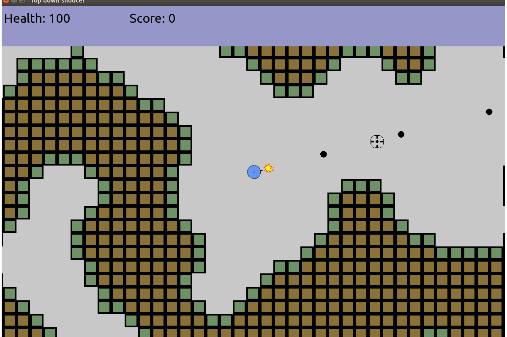

# top_down_shooter

Basic engine for top-down shooter game implemented in C++ using SFML

Requirements: 
    1) C++11 
    2) SFML 2.3.2
    
The program was tested on Ubuntu 16.04 LTS Xenial, gcc 5.4.0.

Instructions:
1) For an out-of-place build: create a build directory (mkdir build)
2) Change directory to the created build directory (cd build)
3) Create build files with CMake in the build directory (cmake ..)
4) Build the project (e.g. for Unix makefiles it is achieved by using "make" command in the terminal)
5) Launch the executable file "top_down_shooter".
6) Mouse controls. Use mouse to navigate the main menu. Click on the menu buttons with left mouse click.
    While in game, use left mouse click to shoot.
7) Keyboard controls. Use WASD keys to move your character up/left/down/right. Press M key to show/hide minimap.
    Press K key to end the game.
8) Currently there is only one sandbox level with a procedurally generated map and without any goal.

The project is early in the development stage and there are a lot of things to be implemented.
